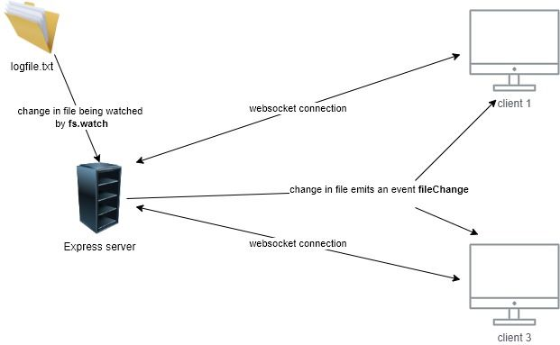
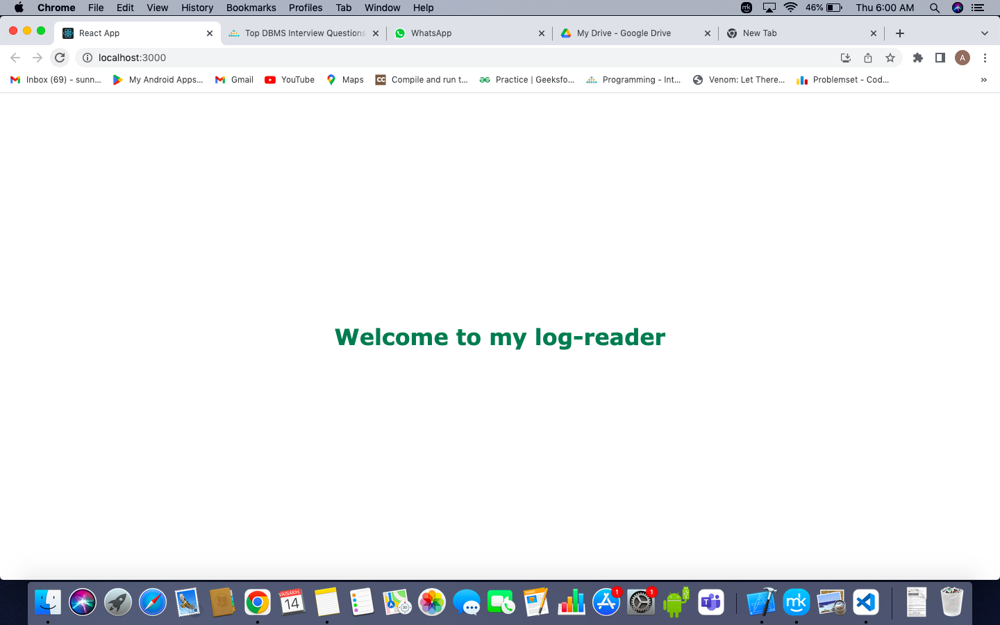
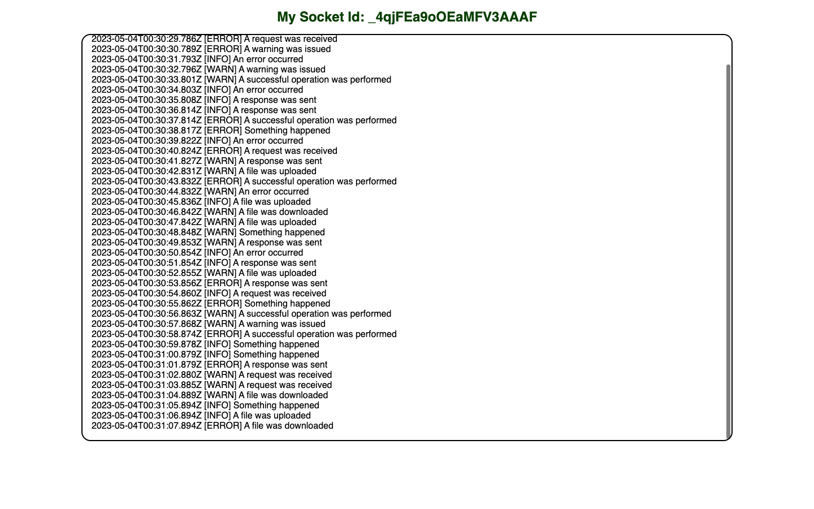

#online log-reader

An online logs reader that is capable of reading text from a file  which is present on the server and show it on the client side.
###Techstack used

- Node.js
- React
- Socket.IO
- Express.js

###Architecture Diagram:

###Setup
1. <b>Prerequisites:</b>
Before starting with the setup process, you need to ensure that you have the following software installed on your system:
- Node.js (v12 or later)
- A code editor (such as VSCode)

2. <b>Server Setup:</b>
- Navigate to the <code>backend</code> directory.
- Run <code>npm install</code>
- Run <code>npm run dev</code> to start the server on dev mode 

3. <b>Client Setup:</b>
- Navigate to the <code>Client</code> directory.
- Run <code>npm install</code>
- Run <code>npm start</code> to start the React Application

### After all the Setup :

### loading page

### Home page

# logreader
